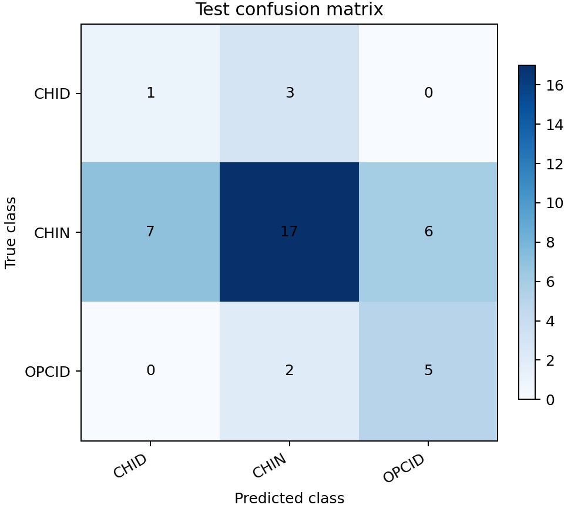
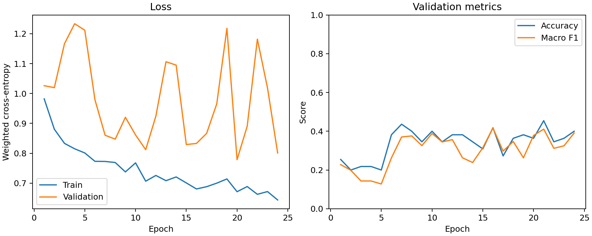
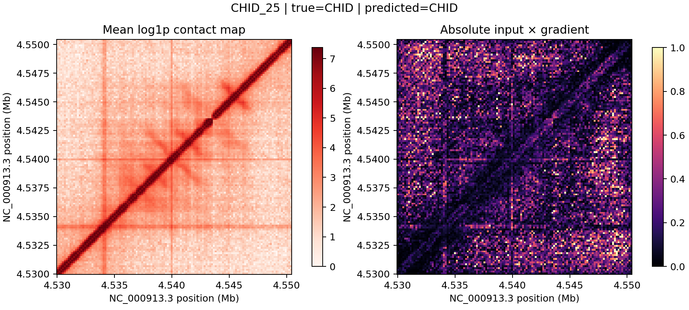
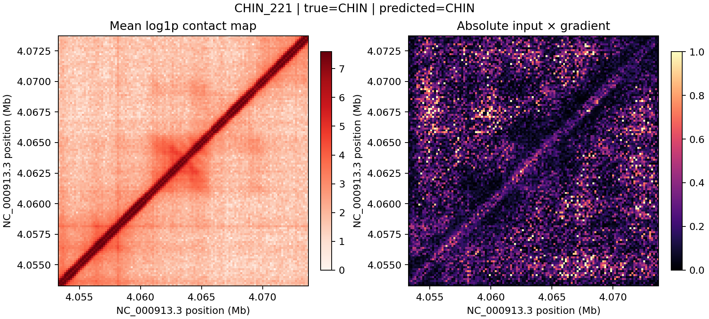
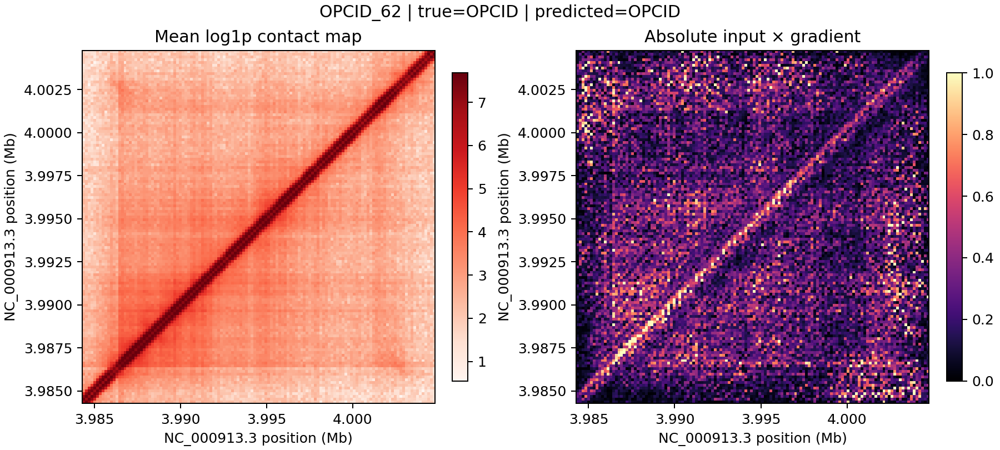

# 任务一 CNN 基线结果

运行日期：2026-09-21。该结果来自当前真实37°C rep1/rep2数据和连续基因组区段划分，仅作为首个可复现基线。

## 实验设置

- 输入：344个结构，每个结构包含rep1、rep2两个通道。
- 单通道尺寸：128 × 128；池化后等效分辨率160 bp；窗口20,480 bp。
- 划分：训练248、验证55、测试41，按连续基因组区段划分。
- 模型：三层卷积块、批归一化、全局平均池化和三分类线性层。
- 训练：加权交叉熵、AdamW、学习率0.001、权重衰减0.0001。
- 选择规则：验证集宏平均F1早停，patience为8。
- 随机种子：2026；CPU训练；最佳epoch为16，共运行24个epoch。
- 标准化：只用训练集计算每个重复通道的均值和标准差。

## 测试结果

| 指标 | 加权CNN | 始终预测CHIN |
| --- | ---: | ---: |
| Accuracy | 0.5610 | 0.7317 |
| Macro F1 | 0.4587 | 0.2817 |
| Macro recall | 0.5103 | 0.3333 |

由于CHIN占测试集30/41，多数类基线具有更高准确率，但完全无法识别CHID和OPCID。加权CNN牺牲总体准确率，换取了对少数类的识别能力，因此当前更应关注宏平均F1、宏平均召回率和每类结果。

| 类别 | 测试数量 | Precision | Recall | F1 |
| --- | ---: | ---: | ---: | ---: |
| CHID | 4 | 0.1250 | 0.2500 | 0.1667 |
| CHIN | 30 | 0.7727 | 0.5667 | 0.6538 |
| OPCID | 7 | 0.4545 | 0.7143 | 0.5556 |

混淆矩阵采用“行是真实类别、列是预测类别”：

| 真实 \ 预测 | CHID | CHIN | OPCID |
| --- | ---: | ---: | ---: |
| CHID | 1 | 3 | 0 |
| CHIN | 7 | 17 | 6 |
| OPCID | 0 | 2 | 5 |

训练和验证曲线：

## 结论与限制

- 端到端训练、验证选择和一次性测试评估已经跑通。
- OPCID在测试集上的召回率为0.7143，说明模型已捕捉到部分可分辨信号。
- CHID仅识别正确1/4，是当前最明显的薄弱点；测试样本太少，单次比例波动很大。
- 验证曲线波动明显，表明样本量、类别不平衡和连续区段分布差异对结果影响较大。
- 当前只运行一个随机种子，没有进行超参数搜索、数据增强或多次重复实验。
- 该结果不能解释为稳定准确率或生物学结论。下一步应先做多随机种子评估、类别策略和窗口/分辨率对照，再开展显著性图分析。

## 初步显著性检查

使用“绝对输入 × 输入梯度”解释预测类别，并从测试集中为每类选择一个预测正确的样本。右图数值按每张图的99百分位缩放，仅表示该模型对该样本预测的局部敏感程度。

三个样本的显著性均较分散，并包含主对角线及远离对角线的响应。当前结果不足以证明模型关注区域符合任何特定生物学机制。正式解释前需要比较错误样本、多个随机种子，并加入梯度平滑或Grad-CAM等稳定性检查。

本地完整输出位于 `outputs/task1_baseline/`，包括模型权重、JSON指标、逐epoch日志、训练曲线和混淆矩阵。
