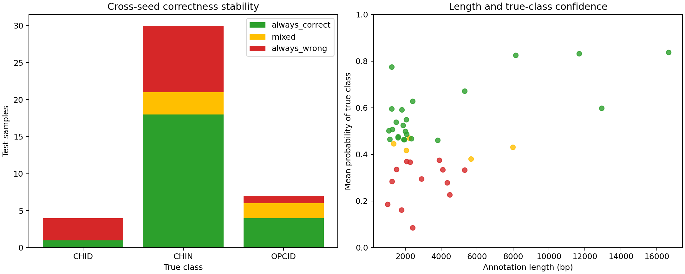
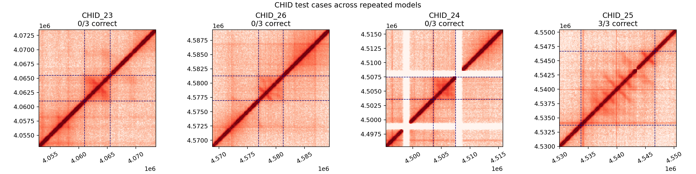

# 任务一跨随机种子错误分析

分析日期：2026-10-08。本分析使用20,480 bp窗口、160 bp池化分辨率，以及Focal Loss策略下种子2026–2028的三个真实模型。目的不是追加一次准确率，而是区分稳定正确、随机种子敏感和稳定错误的测试样本。

## 分析设置

- 数据：`task1_windows_full.npz`，测试集41条。
- 模型：Focal Loss三次训练，随机种子2026、2027、2028。
- 稳定正确：三个模型均预测正确。
- 摇摆样本：三个模型中有1–2次预测正确。
- 稳定错误：三个模型均预测错误。
- 共识预测：三个模型输出概率的均值所对应的最大概率类别。

运行命令：

```bash
python scripts/analyze_errors.py \
  --dataset data/processed/task1_windows_full.npz \
  --checkpoint outputs/task1_imbalance_comparison/focal/seed_2026/model.pt \
  --checkpoint outputs/task1_imbalance_comparison/focal/seed_2027/model.pt \
  --checkpoint outputs/task1_imbalance_comparison/focal/seed_2028/model.pt \
  --output-dir outputs/task1_error_analysis
```

## 总体稳定性

| 类别 | 测试数量 | 稳定正确 | 摇摆 | 稳定错误 | 共识准确率 | 平均真实类别概率 |
| --- | ---: | ---: | ---: | ---: | ---: | ---: |
| CHID | 4 | 1 | 0 | 3 | 0.2500 | 0.3700 |
| CHIN | 30 | 18 | 3 | 9 | 0.7000 | 0.4406 |
| OPCID | 7 | 4 | 2 | 1 | 0.5714 | 0.6162 |
| 合计 | 41 | 23 | 5 | 13 | — | — |



41条测试样本中，23条（56.1%）稳定正确，5条（12.2%）随种子变化，13条（31.7%）稳定错误。稳定错误的主要方向为：CHIN→OPCID 6条、CHIN→CHID 3条、CHID→CHIN 3条、OPCID→CHIN 1条。

## CHID案例

| 结构 | 标注长度 | 三次正确数 | 共识预测 | 平均真实类别概率 |
| --- | ---: | ---: | --- | ---: |
| CHID_23 | 4,480 bp | 0/3 | CHIN | 0.2276 |
| CHID_24 | 3,890 bp | 0/3 | CHIN | 0.3759 |
| CHID_25 | 12,930 bp | 3/3 | CHID | 0.5982 |
| CHID_26 | 4,330 bp | 0/3 | CHIN | 0.2784 |



`CHID_25`是唯一稳定正确的CHID，其接触图包含更明显的非对角响应；另外三个CHID被三个模型一致预测为CHIN。该现象只说明当前模型对输入模式的区分，不足以证明任何生物学机制。标注长度也不是独立解释：较长的 `CHID_25`表现更好，但样本只有4条。

## 重叠标注冲突

测试集中存在14对不同类别的标注区间直接重叠，说明当前三分类任务并不总是满足“一张局部图只对应一个类别”的假设。

- `CHID_23`与 `CHIN_221`、`CHIN_222`、`CHIN_223`重叠，并被三个模型稳定预测为CHIN。
- `CHID_24`与 `CHIN_239`、`CHIN_240`重叠，并被稳定预测为CHIN。
- `CHID_26`与 `CHIN_247`重叠，并被稳定预测为CHIN。
- `CHID_25`与 `CHIN_242`、`CHIN_243`、`CHIN_244`、`CHIN_245`重叠；模型稳定识别 `CHID_25`，同时把其中三条CHIN稳定预测为CHID。
- 另有CHIN与OPCID的重叠案例。

13条稳定错误中还出现三个窗口重叠组：`CHIN_226/227/228`、`CHIN_242/243/244`、`CHID_26/OPCID_68`。因此这些错误不是完全独立的13个证据，部分来自相同或高度相似的局部接触区域。

## 结论与下一步

- CHID低召回并非单纯随机种子波动：3/4测试CHID在三次运行中都稳定错误。
- 当前最重要的数据问题是跨类别重叠标注；继续盲目增大模型可能只会更稳定地学习冲突标签。
- 下一轮应首先输出全数据集跨类别重叠清单，并比较三种处理方式：排除冲突样本、按区域分组评估、改为多标签任务。
- 在确定标签策略后，再比较双重复融合方式和更稳定的解释方法。
- 测试集仅4条CHID，以上结论是工程诊断和建模风险提示，不是统计显著性或生物学结论。

本地输出 `outputs/task1_error_analysis/` 包含逐样本CSV、JSON摘要、稳定性图和CHID案例图；真实数据及完整模型仍由Git忽略。

后续全量审计确认，344条结构中145条涉及跨类别重叠，验证和测试CHID全部冲突，因此不能通过简单删除冲突样本继续三分类。完整结果与区域级多标签方案见 [`docs/task1-overlap-audit.md`](task1-overlap-audit.md)。
