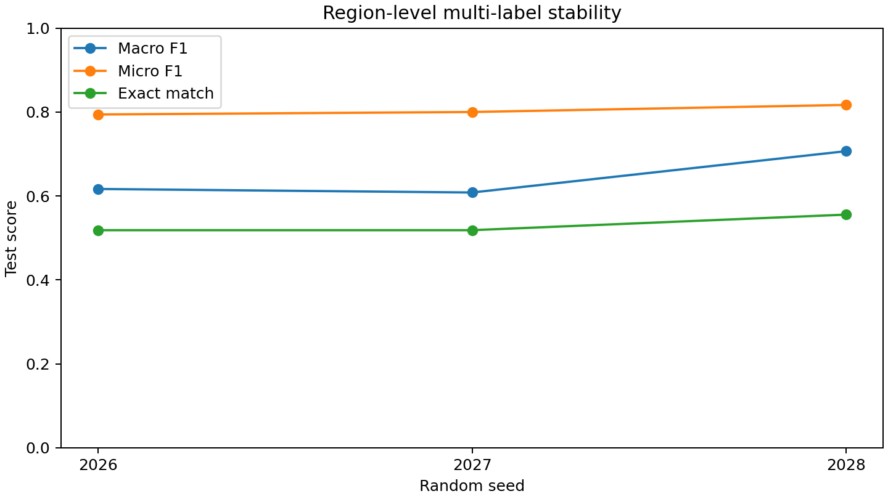
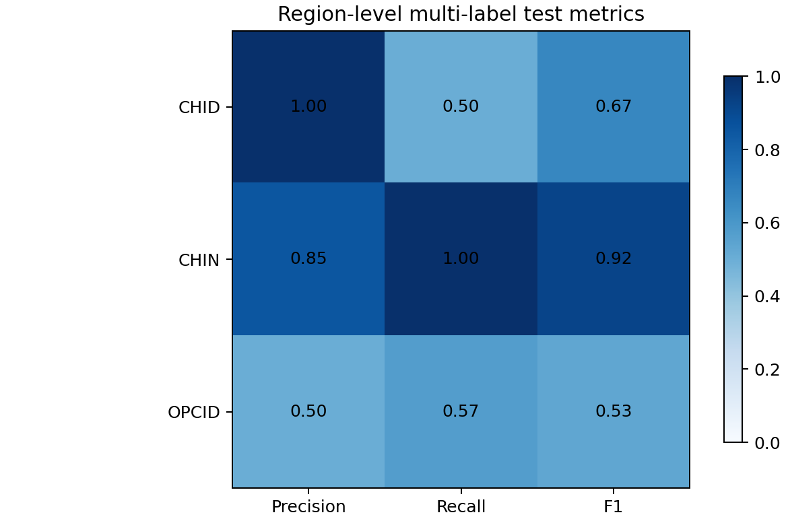

# 任务一：区域级多标签基线

## 一、为什么修改问题定义

原始344条标注不是严格互斥的三分类样本。全量审计发现111对跨类别区间重叠，涉及145条结构；CHID在验证集和测试集中的标注全部与其他类别冲突。继续要求每个窗口只能属于CHID、CHIN、OPCID之一，会让模型面对互相矛盾的监督信号。

因此，本轮将跨类别重叠的标注合并为冲突感知区域，并为每个区域设置三个独立二元标签。合并后共有233个区域：训练173、验证33、测试27，其中34个区域具有多个标签。模型回答的是“该区域是否分别具有CHID、CHIN、OPCID标签”，而不是强迫三个类别互斥。

## 二、方法

1. 使用重叠审计生成的 `region_groups.csv`，区域中心取合并区间中点。
2. 从37°C的rep1和rep2在同一坐标截取20,480 bp窗口。
3. 原始10 bp矩阵按16×16非重叠块求和，得到160 bp分辨率的128×128矩阵。
4. 两个生物学重复作为两个输入通道，采用与历史基线相同的三层CNN。
5. 输出层使用三个独立logit，损失函数为带训练集正样本权重的 `BCEWithLogitsLoss`。
6. 每个标签的决策阈值在验证集0.05–0.95网格上按F1独立选择；阈值选定后不再根据测试集修改。
7. 使用固定随机种子2026、2027、2028重复训练，验证集Macro F1早停。

数据张量形状为 `(233, 2, 128, 128)`，SHA-256为 `6d282eeab1a94edb101a77f186967b4d4521bbfd6007af31d459aa032a924ffb`。

## 三、真实数据结果

| 指标 | 三次运行均值 ± 样本标准差 | 范围 |
| --- | ---: | ---: |
| Macro F1 | 0.6439 ± 0.0546 | 0.6083–0.7067 |
| Micro F1 | 0.8037 ± 0.0118 | 0.7941–0.8169 |
| 精确匹配率 | 0.5309 ± 0.0214 | 0.5185–0.5556 |
| Hamming loss | 0.1687 ± 0.0071 | 0.1605–0.1728 |

逐标签结果：

| 标签 | 测试阳性区域数 | F1均值 ± 标准差 | Recall均值 ± 标准差 |
| --- | ---: | ---: | ---: |
| CHID | 4 | 0.4667 ± 0.1764 | 0.3333 ± 0.1443 |
| CHIN | 23 | 0.9189 ± 0.0019 | 0.9855 ± 0.0251 |
| OPCID | 7 | 0.5460 ± 0.0220 | 0.5714 ± 0.0000 |

种子2028取得三次运行中最高的测试Macro F1（0.7067），但报告主结果使用三次均值，不以最好一次替代稳定性结论。

## 四、阈值与基线解释

三次运行在验证集选出的平均阈值为CHID 0.7333、CHIN 0.0500、OPCID 0.7833。CHIN阈值触及搜索网格下界，说明测试区域中CHIN标签占主导，模型倾向于将多数区域判为CHIN。为避免把类别先验误认为模型能力，训练结果同时保存“预测训练集中出现率不低于50%的标签”这一简单基线；当前规则只会预测CHIN。

该简单基线的测试Macro F1为0.3067、Micro F1为0.7541、精确匹配率为0.5926。多标签CNN的Macro F1和Micro F1明显高于它，但精确匹配率均值0.5309反而更低，因为CNN尝试识别少数标签时会增加部分标签错误。这说明只看精确匹配率会偏爱“永远预测多数标签”的保守模型，因此主指标采用Macro F1，并同时报告所有指标而不隐藏取舍。

多标签结果与旧互斥三分类结果回答不同问题：前者允许一个区域同时具有多个结构标签，后者每个原始结构只能选一个类别。因此不能把本轮Macro F1与旧Accuracy直接比较，也不能用二者数值高低宣称模型绝对改进。本轮的主要改进是消除了已知标签冲突，并给出与标注结构一致的评价方式。

## 五、限制与结论边界

1. 测试集只有27个区域，其中CHID阳性仅4个，CHID F1和召回率仍明显受单个案例影响。
2. CHIN在测试集中占23/27，阈值落到0.05表明类别分布仍高度不平衡。
3. 区域合并基于坐标重叠，是建模规则，不代表重叠标签一定对应新的生物学机制。
4. 三次运行只用于估计随机初始化波动，没有独立外部数据集，不能据此宣称普适性能。
5. 本轮完成的是已知结构识别的冲突修正基线；候选新结构发现必须另行使用全基因组扫描与跨重复验证。

结论：区域级多标签建模能够在不删除全部验证/测试CHID的前提下处理重叠标注，三次测试Macro F1为0.6439 ± 0.0546。CHIN较稳定，CHID仍是主要薄弱点，后续不继续围绕小测试集反复调参，而转入任务二的新结构发现流程。
