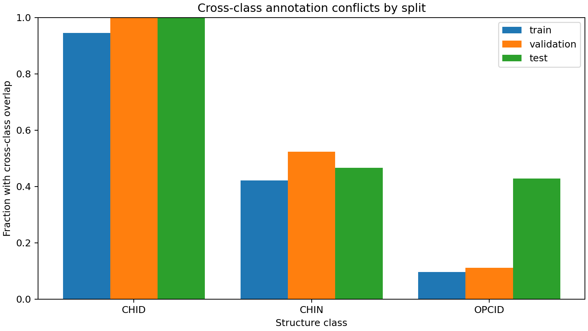

# 任务一跨类别标注重叠审计

审计日期：2026-10-08。本轮对全部344条结构标注执行区间级重叠检查，用于判断“删除冲突样本”是否可行，并为区域级多标签建模准备清单。

## 运行方式

```bash
python scripts/audit_annotation_overlaps.py \
  --structures data/processed/structures_split.csv \
  --output-dir outputs/task1_overlap_audit
```

输出包括：跨类别重叠对、逐结构冲突字段、冲突连通组件、覆盖全部结构的冲突感知区域清单、JSON摘要和冲突比例图。

## 全量结果

- 344条结构中有145条涉及跨类别重叠，占42.2%。
- 共发现111对跨类别重叠：CHID–CHIN 101对，CHIN–OPCID 10对；未发现直接CHID–OPCID重叠。
- 111对关系形成34个跨类别冲突连通组件。



| 数据集 | 类别 | 总数 | 冲突数 | 冲突比例 |
| --- | --- | ---: | ---: | ---: |
| 训练 | CHID | 18 | 17 | 94.4% |
| 训练 | CHIN | 178 | 75 | 42.1% |
| 训练 | OPCID | 52 | 5 | 9.6% |
| 验证 | CHID | 4 | 4 | 100.0% |
| 验证 | CHIN | 42 | 22 | 52.4% |
| 验证 | OPCID | 9 | 1 | 11.1% |
| 测试 | CHID | 4 | 4 | 100.0% |
| 测试 | CHIN | 30 | 14 | 46.7% |
| 测试 | OPCID | 7 | 3 | 42.9% |

CHID与CHIN的大量重叠不是个别测试样本异常，而是整个数据集的系统属性。CHID训练样本中只有1条不与其他类别重叠，验证和测试CHID则全部冲突。

## 为什么不能直接删除冲突样本

若删除所有涉及跨类别重叠的结构，剩余数量为：

| 数据集 | CHID | CHIN | OPCID |
| --- | ---: | ---: | ---: |
| 训练 | 1 | 103 | 47 |
| 验证 | 0 | 20 | 8 |
| 测试 | 0 | 16 | 4 |

验证集和测试集将完全失去CHID，训练集也只剩1条CHID，因此无法继续三分类训练和评估。本轮据此否决“全部删除冲突样本”方案，没有运行一个缺少CHID的清洗模型，也没有伪造新的性能结果。

## 冲突感知区域清单

审计程序把每个跨类别连通组件作为一个区域，其余非冲突结构作为单例区域，得到233个冲突感知区域：

| 标签集合 | 区域数量 |
| --- | ---: |
| CHID | 1 |
| CHID + CHIN | 25 |
| CHIN | 139 |
| CHIN + OPCID | 9 |
| OPCID | 59 |
| 合计 | 233 |

其中34个区域具有两个标签。最大多标签区域包含12条原始标注；最大跨度19,460 bp，小于当前默认20,480 bp窗口，因此下一轮可以沿用当前窗口和160 bp分辨率，无需再次扩大输入范围。

`region_groups.csv`保留区域坐标、标签集合、所属划分和原始结构ID。该清单只合并由跨类别重叠连接的结构；单纯同类别重叠仍保留为独立样本，避免在尚未确定生物学定义前过度合并。

## 下一步方案

建议优先构建区域级多标签基线：

1. 以233个冲突感知区域为样本，输入仍使用20,480 bp窗口、160 bp分辨率和双重复通道。
2. 输出改为CHID、CHIN、OPCID三个独立二元标签，损失函数使用带类别权重的二元交叉熵。
3. 继续采用连续基因组划分，确保整个冲突组件只属于一个集合。
4. 报告每标签Precision/Recall/F1及Macro F1，不再强迫一个区域只能选择一个类别。
5. 将现有互斥三分类保留为历史基线，不直接与多标签指标混为一谈。

以上结论是标注结构和建模可行性审计，不代表重叠类别之间存在新的生物学机制。完整CSV和JSON保存在本地 `outputs/task1_overlap_audit/`，由Git忽略。
