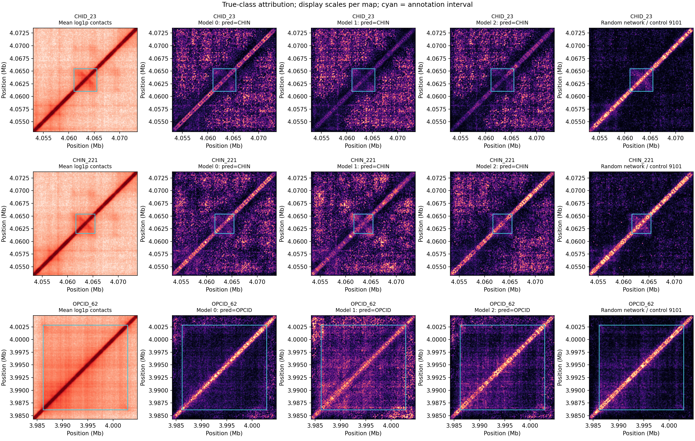

# 任务一：显著性图可信度核验

## 固定协议（先提交，再运行）

初版仅展示每类一个预测正确样本。本轮覆盖全部41个测试结构，保留错误样本，避免只凭三张热图解释模型。

- 固定20,480 bp、160 bp双重复输入和现有Focal模型seed 2026/2027/2028；不重训或调整模型。
- 每个模型对全部测试结构计算**真实类别logit**的绝对`输入×梯度`，错误样本也计算真实类别而非预测类别。
- 输入按该模型保存的训练集均值/标准差变换；通道绝对归因取平均，再沿对角线对称化。
- 每个已训练模型配一个同架构、全部参数和批归一化状态重新初始化的对照，固定控制seed 9101/9102/9103。
  使用对应已训练模型的输入标准化和相同目标类别，不把对照预测当分类实验。
- 只在上三角唯一像素对上计算归因质量。分别报告<800 bp近对角线质量占比和标注方块内质量占比；同时报告像素面积占比，避免误把大面积当聚焦。
- 跨训练种子、以及各训练模型与其随机对照，在排除<800 bp像素后报告Spearman相关与前10%像素重合。
  分位边界同值用分数权重分配；零/常数归因不强行计算相似度，保存不可评估状态。
- 保存123条逐样本/模型描述、246条归因对比、完整归因矩阵、数据及模型SHA-256、按类别/正确性分组的汇总。
- 展示案例按每类结构ID字典序第一个测试样本选择，不按正确性、相关或视觉效果筛选。

参数重置对照测试的是解释对模型参数/状态的敏感性；跨种子比较的是同划分模型稳定性。
两者均不直接证明忠实性、生物学机制或因果作用；随机网络的批归一化统计也被重置，是本对照的限制。
区域归因可以出现在多个重叠标注内，单类归因不证明某种结构边界。

## 运行与真实结果

协议提交为`946ece1`，使用已有三个Focal模型，不重训。

```bash
PYTHONPATH=src python scripts/audit_saliency_reliability.py \
  --dataset data/processed/task1_windows_full.npz \
  --checkpoint outputs/task1_imbalance_comparison/focal/seed_2026/model.pt \
  --checkpoint outputs/task1_imbalance_comparison/focal/seed_2027/model.pt \
  --checkpoint outputs/task1_imbalance_comparison/focal/seed_2028/model.pt \
  --output-dir outputs/task1_saliency_audit --minimum-offset 5 --batch-size 4
```

对每个结构先取三个模型对的中位数，再在41个结构间汇总：

| 去<800 bp归因图对照 | 结构数 | Spearman中位数 | 前10%分数权重Jaccard中位数 |
| --- | ---: | ---: | ---: |
| 三个已训练模型两两比较 | 41 | 0.6395 | 0.2645 |
| 已训练模型与配对随机网络 | 41 | 0.5832 | 0.2023 |

全部246条模型对/样本记录均可评估，但它们不是246个独立生物学样本。
训练种子之间比随机对照更相似，却仍有明显位置差异；随机对照保留不低的相关，
因此不能排除输入纹理、`输入×梯度`中的输入项和网络架构对解释图的影响。
本核验不设事后通过线、不将差值当显著性，也不宣称“解释性已通过”。

同样先在结构内对三个模型取中位数，再在41个结构间汇总：

| 归因质量指标 | 已训练模型 | 随机网络 |
| --- | ---: | ---: |
| <800 bp近对角线质量占比 | 15.21% | 32.73% |
| 当前结构标注方块内质量占比 | 1.80% | 3.37% |
| 标注质量占比 / 标注像素面积占比 | 1.54 | 3.12 |

近对角线像素本身占上三角唯一像素对的7.63%。不同结构的标注面积不同，
所以“质量占比的中位数”不能除以“面积占比的中位数”来重算最后一行。
随机网络也表现出标注方块质量富集，甚至更高，说明“热区位于标注内”不足以证明模型学到该结构。
这是对旧显著性示例的重要限制，而不是用随机网络替代分类模型。



例子按各类结构ID字典序预定为CHID_23、CHIN_221、OPCID_62。
CHID_23被三个模型全部错判为CHIN；另外两个例子均预测正确。
图中均解释真实类别logit，蓝框仅表示标注范围；每张图独立显示缩放，亮度不可跨图比较。
与旧版“解释预测类别、优先挑正确样本”的示例属于不同口径，不能直接对比颜色强弱。

输出含逐模型/样本123行、模型对/样本246行、结构内汇总82行、41条归因质量汇总、
六组类别×正确性描述、归因NPZ、完整输入/模型哈希及预定案例图。
下一步需要距离匹配的受控遮挡对照，检验高归因区域是否更影响目标logit；
遮挡本身也可能制造分布外输入，所以不能由一次遮挡实验推断生物学因果。
