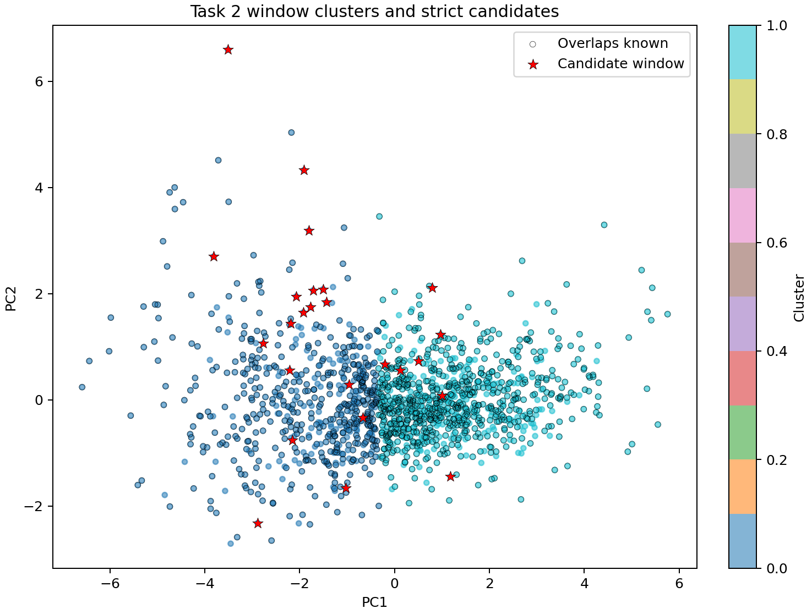
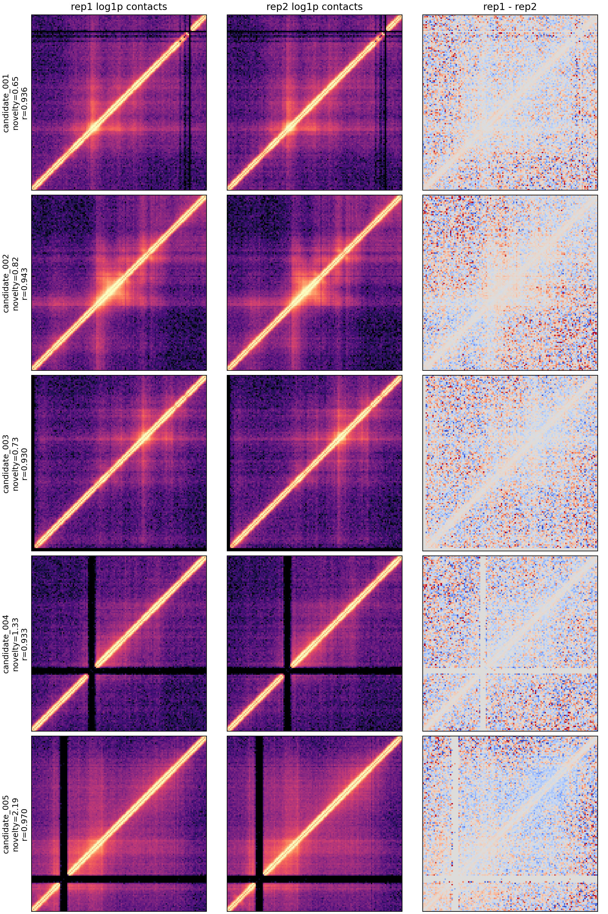
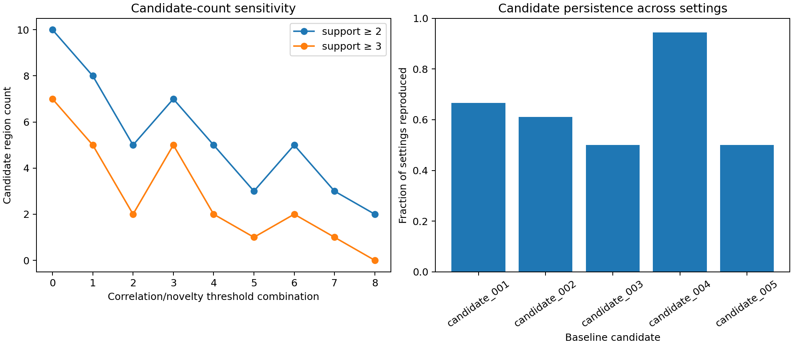

# 任务二：聚类、已知结构排除与候选验证

## 一、从热图复核反推质量控制

初版聚类产生6个区域，但双重复热图显示多个高新颖度区域含大面积整行/整列零信号。这种“黑色十字”更可能来自覆盖缺口或不可用bin，而不是新的接触结构。

因此在最终流程中增加两个事先可计算的伪影指标：零接触bin比例和最长连续零bin比例。两份重复均要求二者不超过3%，即128-bin窗口中最多允许约3个零bin。原始1,807个窗口中1,498个通过最终质量控制，309个被排除。这个修正由视觉质检触发，开发日志保留了修改前后的结果，避免把技术伪影包装成生物学发现。

## 二、聚类方法与结果

对1,498个合格窗口使用8项可解释特征：总接触数的对数、非零比例、近/远距离比值的对数、距离衰减斜率、中心富集、变异系数、接触熵和rep1/rep2相关性。

1. 每项特征使用中位数和四分位距稳健标准化。
2. PCA保留累计解释方差至少90%的主成分，最多6个。
3. 对 `k=2–8` 分别运行10次确定性K-means++初始化。
4. 使用平均轮廓系数选择聚类数量。
5. 以到最近“已知结构重叠窗口”的PCA距离作为特征新颖度。

PCA保留3个主成分，累计解释94.58%的特征方差。轮廓系数在 `k=2` 时最高：

| k | 轮廓系数 |
| ---: | ---: |
| 2 | **0.4073** |
| 3 | 0.3865 |
| 4 | 0.3305 |
| 5 | 0.3257 |
| 6 | 0.3067 |
| 7 | 0.3085 |
| 8 | 0.2947 |

最终两簇分别包含603和895个窗口；已知结构重叠比例分别为74.63%和74.75%。聚类用于描述形态，不直接给任何簇赋予新生物学名称。

## 三、最终候选判定规则

一个窗口必须同时满足：

1. 有限值比例不低于99%，非零像素比例不低于1%。
2. 两份重复的零bin比例和最长连续零bin比例均不超过3%。
3. 整个20,480 bp窗口与344条CHID、CHIN、OPCID均无直接区间重叠。
4. rep1/rep2上三角 `log1p` 接触矩阵相关性不低于0.90。
5. 到最近已知窗口的PCA距离位于满足前4项窗口的最高10%。
6. 命中窗口按起点间距不超过5,120 bp合并，合并区域至少需要2个窗口支持。

这是一套清晰且可复算的计算定义，但阈值仍不是生物学金标准，因此结果统一称为“疑似候选”。

## 四、最终真实数据候选

1,498个合格窗口中379个与已知结构完全不重叠。应用最终规则后得到25个候选窗口，合并为5个疑似区域：

| 候选 | 区间 | 支持窗口 | 代表中心 | 簇 | 新颖度 | 重复相关性 | 最近已知结构距离 |
| --- | --- | ---: | ---: | ---: | ---: | ---: | ---: |
| 001 | 1,251,840–1,280,000 | 4 | 1,262,080 | 0 | 0.6546 | 0.9357 | 400 bp |
| 002 | 1,891,840–1,914,880 | 2 | 1,904,640 | 0 | 0.8167 | 0.9429 | 20,440 bp |
| 003 | 1,978,880–2,004,480 | 2 | 1,989,120 | 0 | 0.7317 | 0.9302 | 11,570 bp |
| 004 | 3,458,560–3,486,720 | 4 | 3,473,920 | 1 | 1.3338 | 0.9330 | 14,980 bp |
| 005 | 4,172,800–4,195,840 | 2 | 4,183,040 | 0 | 2.1925 | 0.9696 | 21,560 bp |

候选001距离最近已知结构仅400 bp，需要警惕边界效应；候选005新颖度与重复相关性最高，但对阈值变化的持续性一般。候选002和003的热图显示跨重复一致的中心富集形态，候选004在18组设置中复现17次，是参数稳定性最高的区域。

## 五、双重复热图与敏感性分析

对重复相关性阈值0.88/0.90/0.92、新颖度分位数0.85/0.90/0.95、最小支持窗口2/3做18组组合：

- 候选区域数量范围为0–10，中位数为4，说明候选总数对阈值较敏感。
- 候选001、002、003、004、005的复现比例分别为66.7%、61.1%、50.0%、94.4%、50.0%。
- 候选004最稳定；没有一个区域同时具备“最高新颖度、最高重复相关性、无零bin、所有阈值均复现”的全部条件。

## 六、结论边界

- 这5个区域是可复现计算流程的结果，不是经独立实验确认的新结构。
- 相邻窗口高度重叠，支持窗口数量不能当作独立生物学重复。
- 新增零bin质量控制显著改变了聚类和候选坐标，说明热图复核是必要步骤。
- 最稳妥的报告结论是“获得5个疑似候选，其中候选004对参数最稳定，候选002/003呈现较清晰的跨重复中心富集；仍需独立实验验证”，而不是宣称发现了5种新结构。
