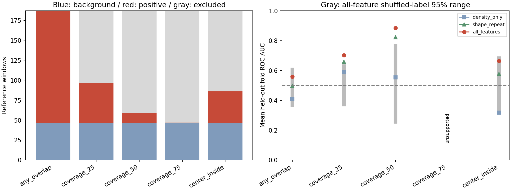

# 任务二：窗口标签敏感性核验

## 固定协议（先提交，再运行分类对照）

本补充实验用于诊断弱可分性，不修改`task2-main-v1`候选，也不替代原特征核验。
原始对照已使用过这些区域，因此本轮是探索性敏感性分析，不是新的未接触测试集。

- 使用同一187个QC合格、原点对齐、不重叠的20,480 bp窗口与344条已知结构标注。
- 标注覆盖按区间并集计算，避免重叠标注重复累加。
- 固定五个基因组折及原187窗口确定的测试区间，训练缓冲20,480 bp。
  排除窗口后不缩短测试区间，不让原缓冲中的训练窗口重新进入。
- 固定五种规则：任意正长度重叠；并集覆盖至少25%、50%、75%；窗口中心位于任一标注内（左闭右开）。
- 各规则的背景始终是原来的46个零重叠窗口。原本有重叠、但不满足更严格规则的窗口仅排除，不重标为背景。
- 固定原8特征、密度2特征、形态/重复6特征；训练折内median/IQR缩放、类别平衡逻辑回归、L2=0.01、分类阈值0.5。
- 若任一折训练或测试缺少一类，则整条规则不报告五折平均或合并AUC；保存各折人数及不可评估原因，不调整折数/阈值来获取结果。
- 对可评估规则使用100次折内打乱标签（seed=2026），保留各折人数；只作描述性对照，不声称生物学显著性。
- 保存逐窗口标签角色、逐折人数、留出预测、训练窗口ID/拟合参数、全部规则指标、输入SHA-256及图。

## 运行前的标签人数检查

| 基因组折 | 零重叠背景 | 任意重叠 | ≥25% | ≥50% | ≥75% | 重叠>0且≤10% |
| --- | ---: | ---: | ---: | ---: | ---: | ---: |
| 0 | 9 | 23 | 9 | 3 | 0 | 3 |
| 1 | 7 | 33 | 11 | 2 | 0 | 2 |
| 2 | 11 | 28 | 10 | 3 | 0 | 7 |
| 3 | 12 | 26 | 10 | 1 | 0 | 7 |
| 4 | 7 | 31 | 11 | 4 | 1 | 10 |

141个重叠窗口的并集覆盖中位数为19.58%，29个覆盖不超过10%。
结构长度中位数：CHIN 2,080 bp、OPCID 4,595 bp、CHID 8,030 bp。
窗口远大于多数标注，所以覆盖门槛会偏向长结构/标注密集区域；低覆盖不等于错误标签。
75%规则预计无法做五折评估，仍按协议记录。中心规则也可能漏掉偏离窗口中心的短结构。

## 结论边界

不同规则的样本难度与类别构成不同，AUC变化不能直接归因于原标签错误，不能视为原任务性能提升。
零重叠只表示未被当前标注，不是经生物学确认的阴性。任何结果均不证明五个候选为新结构。

## 运行方式与真实结果

协议在`54fddb0`提交后运行；使用同一真实扫描表和结构标注，不重新筛选候选。

```bash
PYTHONPATH=src python scripts/audit_window_labels.py \
  --windows outputs/task2_window_scan/candidate_windows.csv \
  --structures data/processed/structures.csv \
  --output-dir outputs/task2_label_sensitivity \
  --window-bp 20480 --purge-bp 20480 --folds 5 --permutations 100 --seed 2026
```

| 标签规则 | 正例 | 固定背景 | 排除 | 密度2项AUC | 形态/重复6项AUC | 全8项AUC（折均值±样本SD） | 全8项打乱标签2.5%–97.5%范围 |
| --- | ---: | ---: | ---: | ---: | ---: | --- | --- |
| 任意重叠 | 141 | 46 | 0 | 0.4083 | 0.4971 | 0.5582 ± 0.0964 | 0.3677–0.6064 |
| 并集覆盖≥25% | 51 | 46 | 90 | 0.5885 | 0.6589 | 0.7023 ± 0.0542 | 0.3720–0.6290 |
| 并集覆盖≥50% | 13 | 46 | 128 | 0.5530 | 0.8226 | 0.8842 ± 0.0493 | 0.2554–0.7637 |
| 并集覆盖≥75% | 1 | 46 | 140 | 不可评估 | 不可评估 | 不报告 | 不报告 |
| 中心位于标注内 | 40 | 46 | 101 | 0.3172 | 0.5769 | 0.6648 ± 0.0625 | 0.3411–0.6826 |

这里的SD表示五个折之间的波动，不是置信区间；灰色打乱标签范围也不是观测AUC的置信区间。
各规则零重叠背景身份完全相同。任意重叠规则的全部留出概率与原基线逐窗口比对，最大绝对差为0。



25%规则各折测试正例为9/11/10/10/11；50%规则仅3/2/3/1/4，包含一个只有1个正例的测试折。
75%规则前四个测试折无正例，最后一折训练无正例，所以整条规则不计算AUC，未通过改变划分来补分数。

观察支持“较大标注覆盖子集具有更强的特征可分性”，且密度对照低于形态/重复或联合特征。
但覆盖≥50%的高AUC建立在极少且经标签筛选的13个正例上，25%也排除了90个原正例；
它们回答的是不同子集问题，不是原141个正例上的性能改进。中心包含规则仍落在其打乱标签范围内。
结果提示标注覆盖/结构尺度是原对照需要解释的因素，**不能据此把原任务二可分性缺口标为完成**。

输出包括935条“187窗口×5规则”标签角色与预测、25条折人数、完整拟合/置换与输入哈希JSON、对照图。
排除行的评估标签为-1、概率为空；不可评估规则的全部概率为空，避免其被误当作预测结果。

下一步应以结构为单位核验形态/尺度及跨重复一致性，并与固定候选的独立证据对齐；
不继续在已见测试区域上搜索覆盖阈值或用最好子集替换主结论。
