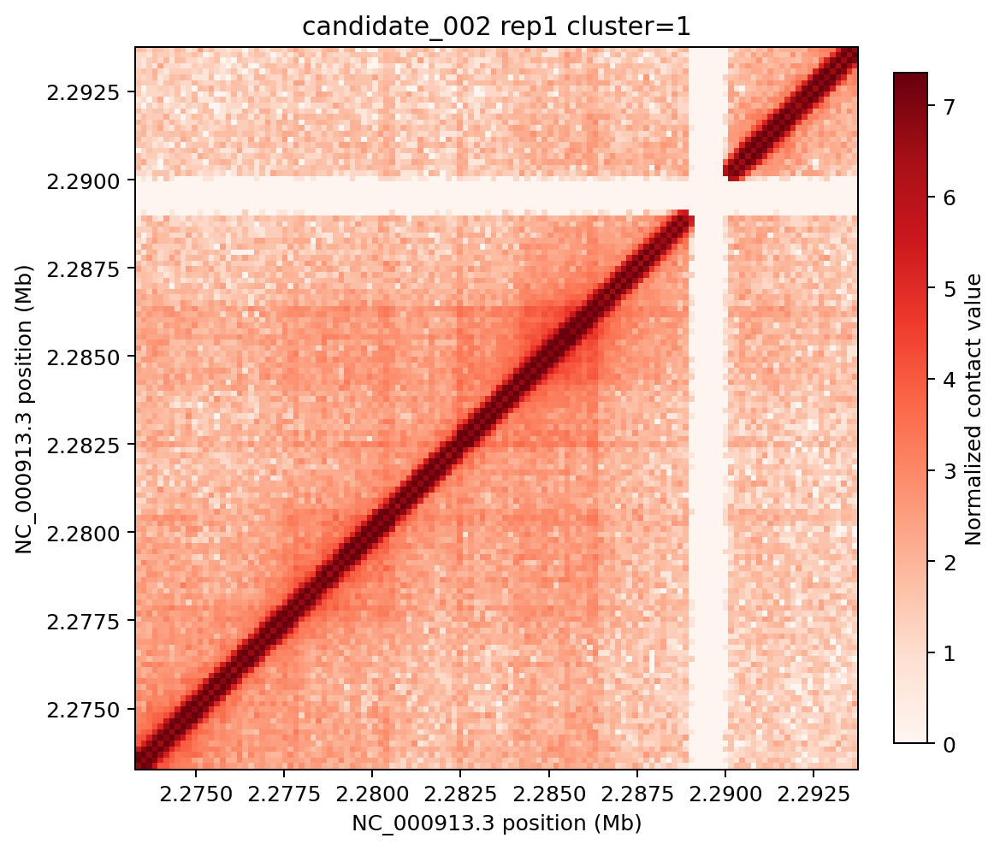
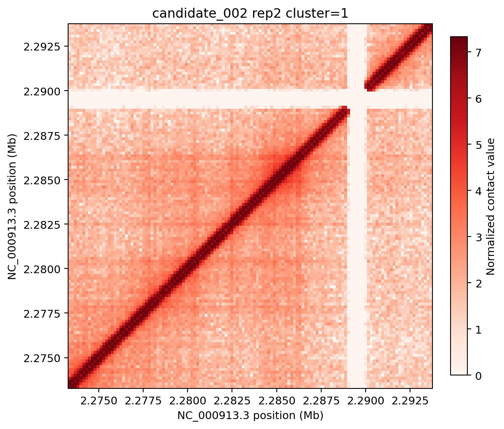

# 任务二：全基因组候选结构扫描

## 一、扫描设计

本轮把任务二拆成可复查的工程流程：

`同坐标滑窗 → 质量检查 → 可解释特征 → 标准化/PCA → K-means → 排除已知结构 → 双重复一致性 → 候选排序`

参数为20,480 bp窗口、20,480 bp步长、16倍池化（160 bp特征分辨率）和8个聚类。两个生物学重复始终使用完全相同的坐标。每个窗口提取：平均/中位数/最大接触、对角线均值、近对角线均值、远距离均值、近远比、对称性误差、零值比例、缺失比例和距离衰减斜率。

候选判定规则预先固定为：

1. 两个重复都通过质量过滤；
2. 与 `structures.csv` 中任何已知区间没有正长度重叠；
3. 两个重复的池化矩阵相关系数不低于0.3；
4. 所属聚类至少有3个窗口。

这些规则用于筛选“待复核候选”，不等同于生物学新结构的证明。

## 二、真实扫描结果

全基因组共产生226个完整窗口，226个均通过当前质量条件。标准化特征被分为8个簇，簇大小为16、45、42、27、22、40、28、6。应用已知结构排除、相关系数和簇大小规则后，保留8个候选：

| 候选 | 坐标（NC_000913.3） | 簇 | 簇大小 | rep1/rep2相关 |
| --- | --- | ---: | ---: | ---: |
| candidate_001 | 204,800–225,280 | 1 | 45 | 0.9254 |
| candidate_002 | 2,273,280–2,293,760 | 1 | 45 | 0.9250 |
| candidate_003 | 389,120–409,600 | 1 | 45 | 0.9192 |
| candidate_004 | 2,068,480–2,088,960 | 1 | 45 | 0.9179 |
| candidate_005 | 1,966,080–1,986,560 | 1 | 45 | 0.9109 |
| candidate_006 | 2,498,560–2,519,040 | 2 | 42 | 0.9267 |
| candidate_007 | 1,904,640–1,925,120 | 5 | 40 | 0.9335 |
| candidate_008 | 4,075,520–4,096,000 | 5 | 40 | 0.9312 |

每个候选的 `candidate_regions.csv`、PCA坐标、标准化参数和rep1/rep2热图均保存在 `outputs/task2_novel_scan/`。例如：

## 三、结果边界

1. 当前步长与窗口大小相同，适合首轮全基因组筛查，但可能漏掉位于窗口边界附近的局部结构；下一轮做半窗口步长敏感性分析。
2. 所有窗口都通过质量条件，说明当前数据在这个尺度没有被低计数过滤区分开；后续应增加基于总接触量分位数的严格过滤对照。
3. 候选按跨重复一致性和簇规模排序，没有使用任务一标签训练模型，因此不会把已知分类模型的偏差直接带入新结构发现。
4. “无已知重叠”只说明坐标上没有覆盖现有标注，不代表区域不存在未标注的已知生物学功能。
5. 当前输出是候选清单和可复核热图，不宣称发现了8个新结构；需要步长/阈值敏感性、跨重复稳定性和报告中的人工热图复核后才能形成候选结论。

下一轮将围绕步长减半、相关阈值和聚类数做小规模敏感性对照，并把稳定候选接入任务三多轨道图。
