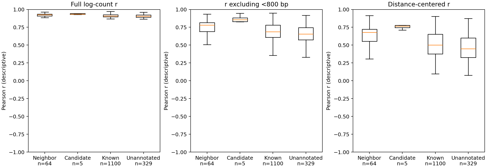

# 任务二：去对角线与距离趋势的重复一致性核验

日期：2026-10-09。主流程：`task2-main-v1`；不使用历史226窗口/8候选作为报告主结果，不根据本轮指标重新筛选候选。

## 1. 为什么需要这项核验

两个重复都具有强主对角线和距离衰减，整图相关性可能高估特殊形态的一致性。本轮在预先固定的5个候选上增加描述性验证，并覆盖全部1,498个质量合格窗口作为参照。不是挑出几张好图后只报告它们。

## 2. 固定计算协议

- 使用同坐标、160 bp、128×128、原始求和计数矩阵；逐像素`log1p`，只取上三角避免对称像素重复计数。
- 原始相关：所有上三角像素，包括主对角线，与原主流程定义相同。
- 去近对角线相关：保留偏移至少5 bin（800 bp）的偏对角线；每条偏对角线至少包含3个像素。
- 距离中心化相关：对上述保留像素，在各重复内部按偏移距离减去该条偏对角线的`log1p`均值，再计算残差Pearson相关。
- 这不是全基因组observed/expected归一化；仅消除窗口内部的距离均值趋势。常数残差相关未定义，输出缺失，不填造假的0或1。
- 候选代表窗口优先归入候选组；其他与合并候选区间有正长度重叠的窗口归入邻域；剩余分成已知重叠与无标注背景。邻域包含19个已知重叠窗口，因此剩余已知组不是所有1,119个已知重叠窗口。
- 核对代表窗口被对应候选坐标完整包含，防止同名候选串用。稳定身份为`task2-main-v1:染色体:起点-终点`。

## 3. 固定5个候选结果

| 候选（主流程） | 合并区间（NC_000913.3） | 原始r | 去<800 bp的r | 距离中心化r |
| --- | --- | ---: | ---: | ---: |
| 001 | 1,251,840–1,280,000 | 0.9357 | 0.8558 | 0.7787 |
| 002 | 1,891,840–1,914,880 | 0.9429 | 0.8832 | 0.7092 |
| 003 | 1,978,880–2,004,480 | 0.9302 | 0.8306 | 0.7447 |
| 004 | 3,458,560–3,486,720 | 0.9330 | 0.8268 | 0.7654 |
| 005 | 4,172,800–4,195,840 | 0.9696 | 0.9448 | 0.9311 |

五个代表窗口扣除距离趋势后均保持正相关（0.7092–0.9311），因此一致性并非完全由主对角线/距离均值造成。但这仅支持“特殊纹理在两重复中一致”，不是“纹理是新的生物学结构”。候选004在此前18组参数中最稳定，候选005残差一致性最高；二者回答不同问题，不能混同。

## 4. 全窗口描述性参照

| 分组 | 窗口数 | 原始r中位数 | 去近对角线r中位数 | 距离中心化r中位数 |
| --- | ---: | ---: | ---: | ---: |
| 候选代表 | 5 | 0.9357 | 0.8558 | 0.7654 |
| 候选邻域 | 64 | 0.9247 | 0.7816 | 0.6788 |
| 剩余已知重叠 | 1,100 | 0.9081 | 0.6872 | 0.5019 |
| 无标注背景（排除候选邻域） | 329 | 0.9056 | 0.6565 | 0.4494 |



图中箱体为四分位距，中线为中位数，须为1.5倍IQR范围内的观测值，不展示离群点；所有面板共用[-1,1]轴。精确结果与四分位数见[汇总快照](task2-replication-summary.json)；逐候选身份及指标见[候选登记表](task2-candidate-registry.csv)。

不能从该表宣称统计显著：候选本来就按原始重复相关性及含相关性特征的新颖度选择，存在选择效应；组内窗口重叠，非独立；背景仅无现有标注，不是已证实阴性。需要独立参照或预设留出验证来支持新颖性，当前不报告无依据的p值。

## 5. 复现

```bash
python scripts/audit_candidate_replication.py \
  --cool data/processed/GSE272159_37C_rep1.160bp.cool \
  --cool data/processed/GSE272159_37C_rep2.160bp.cool \
  --windows outputs/task2_clustering/window_clusters.csv \
  --candidate-regions outputs/task2_clustering/candidate_regions.csv \
  --output-dir outputs/task2_replication_audit --minimum-offset 5
```

输出包括全部1,498窗口的指标CSV、稳定候选登记表、描述性JSON和对照图。回归测试覆盖共享距离衰减但无纹理的反例、不同距离均值下共享纹理的正例、修改主对角线不改变去对角线指标、坐标串用拒绝，以及微型COOL端到端接口（合成夹具不作为实验结果）。

## 6. 后续仍缺

独立重复的候选发现/簇归属验证、距离尺度敏感性、已知结构召回参照及合适阴性或随机移位对照。结构坐标与网格一致性已有核验，但原论文未明示表格闭开规则。当前5个对象继续称“疑似候选”，不称为发现5种新结构。
