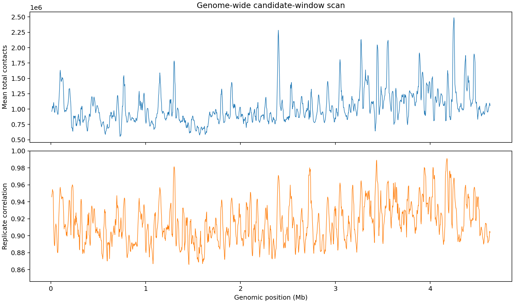

# 任务二：全基因组候选窗口与特征底座

## 一、本轮目的

本轮只建立全基因组候选窗口和可解释特征表，不在尚未聚类、排除已知结构和跨重复筛选前宣称发现新结构。

## 二、数据与参数

| 项目 | 设置 |
| --- | --- |
| 染色体 | NC_000913.3 |
| 生物学重复 | 37°C rep1、rep2 |
| 原始分辨率 | 10 bp |
| 扫描分辨率 | 160 bp（16×16计数求和） |
| 窗口长度 | 20,480 bp（128×128） |
| 步长 | 2,560 bp（16 bins） |
| 窗口数量 | 1,807 |
| 最低非零比例 | 0.01 |
| 最低有限值比例 | 0.99 |
| 最高零bin比例 | 0.03 |
| 最长连续零bin比例 | 0.03 |

池化文件与特征表的SHA-256：

- rep1 160 bp COOL：`a2f0dab8a87b56dabce9ee7151b8ef3d59b1d7559563ede2ec8989d3cb56d986`
- rep2 160 bp COOL：`5f75a3b3512355c0e778298ac0fdff4c3eacc2b833b91cef8eb5f6572c557a3e`
- 最终候选特征表：`e8ad603fb1cb9e1bcb8d21a8a9246b1c2f75873f442a620b78fcaa66d4d0ba5d`

以上大文件和完整CSV位于Git忽略目录，只在本地保存；脚本、参数和摘要进入仓库。

## 三、特征设计

每份重复独立计算以下特征，并额外保存两份重复的均值和绝对差：

1. 总接触数、均值、标准差、最大值和非零比例：描述覆盖与总体强度。
2. 主对角线均值、1–3 bins近距离带、4–15 bins中距离带和16–63 bins远距离带均值：描述接触随基因组距离变化的形态。
3. 近距离/远距离比值与对数距离衰减斜率：描述距离衰减速度。
4. 中心富集度：比较窗口中心区域与全窗口平均接触强度。
5. 变异系数和归一化接触熵：描述局部纹理集中程度。
6. 零接触bin比例和最长连续零bin比例：识别会在热图上形成黑色横纵条带的覆盖缺口。
7. rep1/rep2矩阵相关性：对上三角 `log1p` 接触值计算Pearson相关。

这些特征优先保证可解释性。它们是候选排序和聚类输入，不是生物学结构定义本身。

## 四、真实数据质检结果

初版基础检查中1,807个窗口全部通过，但候选热图暴露了整行/整列零信号伪影。加入零bin及连续零段不超过3%的最终标准后，1,498个窗口通过，309个窗口被排除。

窗口级rep1/rep2相关性：

| 统计量 | 数值 |
| --- | ---: |
| 平均值 | 0.9114 |
| 中位数 | 0.9082 |
| 最小值 | 0.8660 |
| 最大值 | 0.9712 |

## 五、解释边界与下一步

- 82.90%的窗口通过最终质检；被排除窗口不参与聚类，避免覆盖缺口主导新颖度。
- 相邻窗口高度重叠，因此1,807不是独立样本数量；后续候选必须合并相邻命中区间。
- 高重复相关性是数据一致性的基础，不足以证明某种局部形态是新结构。
- 后续聚类、已知结构排除、热图复核和敏感性分析均只使用最终质检通过窗口。
