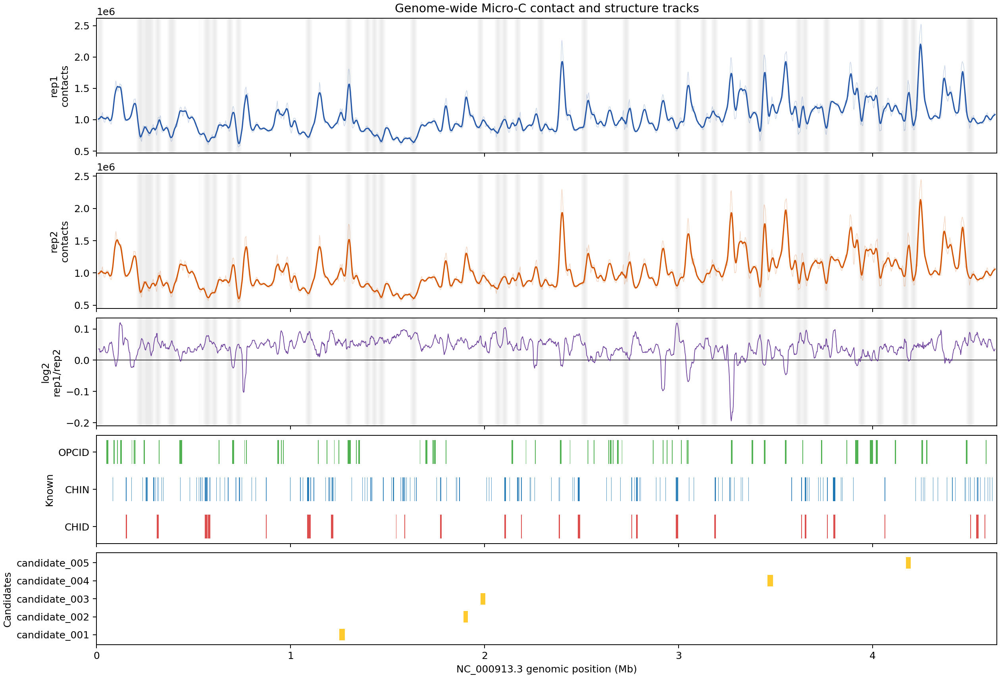
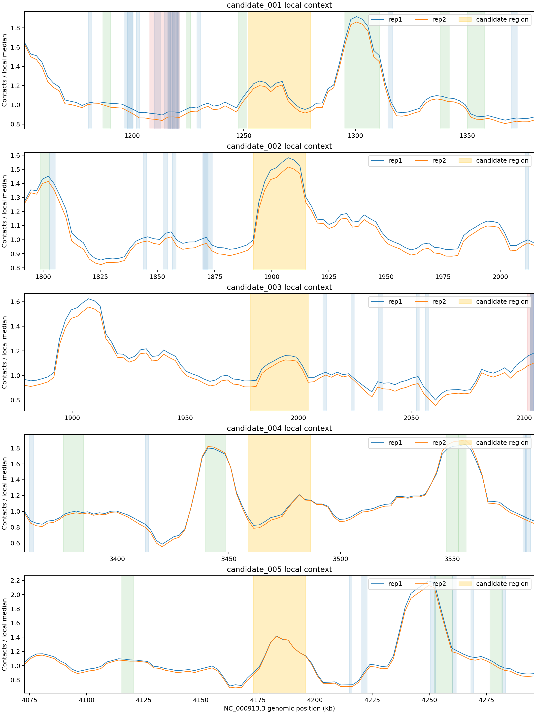

# 任务三：接触频率与结构分布可视化

## 一、图层设计

本轮采用单染色体 genome-browser 风格的多轨道图，所有轨道使用 `NC_000913.3` 的同一坐标轴：

1. rep1窗口接触总量原始曲线与9窗口中心滚动均值；
2. rep2窗口接触总量原始曲线与滚动均值；
3. `log2((rep1+1)/(rep2+1))` 重复差异轨道；
4. CHID、CHIN、OPCID已知结构区间轨道；
5. 任务二筛出的5个疑似候选区域轨道。

质量未通过的窗口用浅灰背景标出，避免把覆盖缺口误解成接触频率变化。当前没有经过核验的MG1655基因注释文件，因此明确不绘制基因位置。

## 二、真实数据结果

图中使用1807个20,480 bp滑窗，其中1498个通过任务二最终质量控制；已知结构数量为CHID 26、CHIN 250、OPCID 68；候选区域数量为5。rep1和rep2的全局趋势整体一致，但在部分区段存在明显的局部差异，适合作为后续条件比较和候选复核的背景轨道。

候选局部图中蓝色和橙色曲线分别为两个重复，黄色区域为候选区间，浅色竖带为附近已知结构。candidate_002、candidate_003和candidate_004的两个重复在候选区间附近具有相近的局部形态；这只能说明计算复现性较好，不能单独证明新的生物学结构。

## 三、复现与限制

- 复现命令见README中的任务三小节；输出摘要保存在 `outputs/task3_tracks/summary.json`。
- 候选只使用`task2-main-v1`的5个坐标，不使用历史8候选；身份见[候选登记表](task2-candidate-registry.csv)。
- 滚动均值只用于视觉降噪，不参与任务二候选打分。
- 全局图中的接触总量受窗口覆盖和测序深度影响，不能直接当作绝对接触概率。
- 当前仅完成同条件双重复的位置与信号展示，尚缺基因及不同实验条件图层；应依据原方案核验要求，不能据此宣称任务三全部达标。缺少的数据和截止安排见[质量清单](quality-review.md)。
