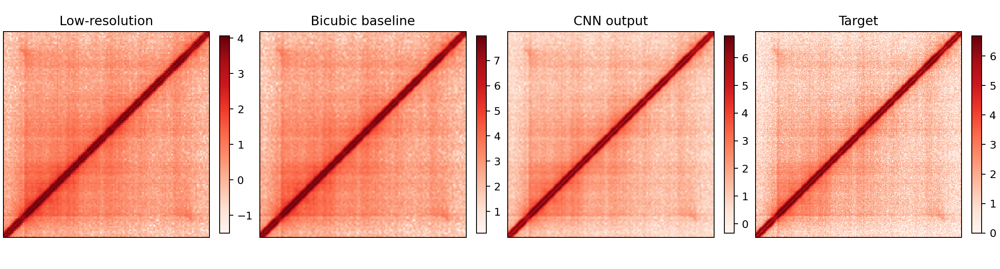

# 选做任务五：接触矩阵超分辨率

## 一、问题定义

输入为两个生物学重复的160 bp分辨率、128×128接触矩阵，目标为相同结构窗口的80 bp分辨率、256×256接触矩阵。模型输入和目标按结构ID对齐，两个重复作为两个通道。80 bp与160 bp数据共同可用的样本用于划分；1个在160 bp窗口中被标记为边界排除的样本不参与训练或测试。

## 二、方法与对照

1. 双三次插值：将160 bp矩阵直接放大2倍，作为无学习基线。
2. 轻量残差CNN：低分辨率输入经三层卷积得到残差，再与双线性上采样结果相加；使用MSE训练。
3. 只用训练集估计输入和目标的通道均值/标准差，验证集用于早停，测试集只做一次最终评估。
4. 指标包括PSNR、全局SSIM和MSE；PSNR使用每张目标图的观测动态范围。

## 三、真实测试结果

| 方法 | PSNR | SSIM | MSE |
| --- | ---: | ---: | ---: |
| 双三次插值 | 14.685 | 0.755 | 1.539 |
| 轻量残差CNN | 23.638 | 0.930 | 0.195 |

在这次固定种子2026的41个测试样本上，CNN相对双三次插值降低了像素误差，并提高了PSNR和SSIM。图中同时展示低分辨率输入、插值结果、CNN输出和80 bp目标；四个面板使用各自的颜色范围，主要用于观察纹理恢复，不用于跨面板比较绝对颜色。

## 四、结论边界

1. 结果来自单个固定随机种子和同一批数据的内部测试，尚未进行多种子稳定性评估。
2. 80 bp目标本身来自已有高分辨率观测，不等于真实实验新增分辨率；模型学习的是数据集内的重建映射。
3. PSNR/SSIM提升不等于恢复了生物学上真实的新接触，必须结合重复一致性和局部热图解释。
4. 后续如有时间，只做多种子复核和代表性结构的定性比较，不继续无止境调参。
