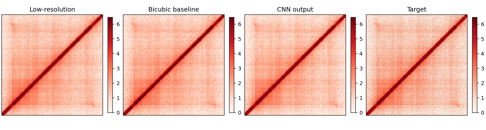
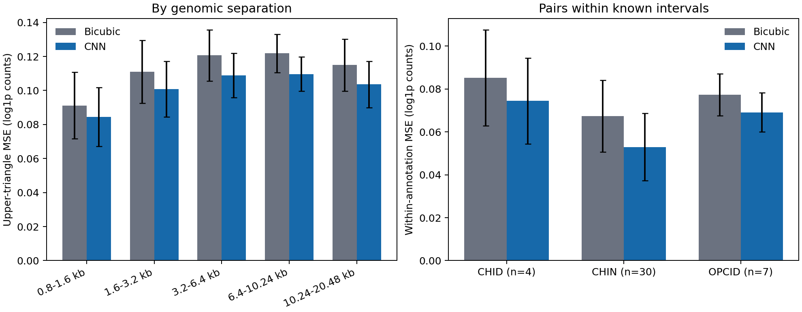

# 选做任务五：公平校正后的接触矩阵超分辨率

更新日期：2026-10-09。以本页替代旧版未校正插值基线的结论，历史日志保留但不得继续引用旧数值作为有效对照。

## 一、问题定义与数据划分

输入为两个生物学重复的160 bp、128×128矩阵，目标为同一基因组窗口的80 bp、256×256矩阵。两份重复作为两个通道，不是独立测试重复。按结构ID、染色体、起止坐标、通道顺序严格对齐，并拒绝训练/验证/测试之间有正长度窗口重叠。

共同可用数据为248个训练、54个验证、41个测试样本；1个在任一分辨率标记为边界排除的样本不参与实验。固定划分不随种子改变，种子2026/2027/2028改变模型初始化与训练顺序。

## 二、修正原因与公平协议

160 bp粗像素是2×2个80 bp细像素计数的求和，不能直接插值后与细像素比较。旧版未校正该差异，低估了插值性能，原“14.685→23.638 dB”的提升不再作为实验结论。

1. 在计数域除以4，再取对数：`low_corrected = log1p(expm1(low_log_counts) / 4)`。不是将对数值直接除以4。
2. 输入和目标共享仅由训练集目标估计的通道均值/标准差；验证和测试不用于拟合尺度。
3. 双三次与CNN都使用校正后的相同输入、输出尺度与非负裁剪。CNN输出显式对称化，体现接触矩阵对称性。
4. 验证集MSE选择最佳epoch（最多20轮，patience=5）；测试用于该预设协议最终比较，不依据测试表现继续挑参数。
5. PSNR和SSIM逐样本、逐重复计算后取均值；动态范围为各目标图观测最大值减最小值。SSIM采用7×7有效区域均匀窗口、总体矩、K1=0.01/K2=0.03的局部统计，不是旧整图SSIM，不与其他实现的分数直接横比。
6. 四联图统一0至目标图99.5%分位数色标；显示截断不影响指标。

## 三、真实测试结果

三种子均值±种子间样本标准差（ddof=1）：

| 方法 | PSNR（dB） | 局部SSIM | MSE（log1p空间） |
| --- | ---: | ---: | ---: |
| 校正双三次插值 | 23.3292 ± 0 | 0.48828 ± 0 | 0.208434 ± 0 |
| 对称残差CNN | 23.6629 ± 0.0018 | 0.51285 ± 0.00080 | 0.193011 ± 0.000079 |

插值不依赖种子，标准差为0。CNN平均改善约0.334 dB，局部SSIM增加0.02458，MSE降低约7.40%。三种子均是小幅改善，不能解释为大幅恢复结构或达到生物学验证标准。

| 种子 | 最佳epoch | CNN PSNR | CNN局部SSIM | CNN MSE |
| --- | ---: | ---: | ---: | ---: |
| 2026 | 20 | 23.6634 | 0.51338 | 0.192989 |
| 2027 | 20 | 23.6609 | 0.51193 | 0.193099 |
| 2028 | 18 | 23.6644 | 0.51325 | 0.192946 |



图为种子2026测试集固定首个窗口的rep1，不按视觉效果挑选；案例与总体指标分开解读，仍需按结构类型及困难区域评价。

## 四、测试集完整矩阵与分层评价

每个种子现在额外保存`test_reconstruction.npz`，包括41个测试结构、两份重复的目标矩阵、校正双三次矩阵、CNN重建矩阵以及结构ID、类别、窗口/标注坐标。矩阵形状均为`(41, 2, 256, 256)`，三个方法均有限；每个压缩文件约38.4 MB，位于Git忽略的`outputs/task5_corrected/seed_*/`，不上传真实数据产物。

分层核验对重复和种子先在同一结构内汇总，再按结构计算跨样本均值与标准差，避免把两个重复或三个随机种子当成额外生物学样本。评价仅使用上三角，排除距主对角线160 bp以内像素，按距离段比较MSE；另对两个像素都落在对应已知标注区间内的像素对计算MSE。误差在`log1p`计数空间，越低越好。

| 分组 | 测试结构数 | 双三次MSE | CNN MSE | 相对变化 |
| --- | ---: | ---: | ---: | ---: |
| 0.8–1.6 kb | 41 | 0.0912 | 0.0844 | -7.4% |
| 1.6–3.2 kb | 41 | 0.1110 | 0.1009 | -9.1% |
| 3.2–6.4 kb | 41 | 0.1206 | 0.1088 | -9.8% |
| 6.4–10.24 kb | 41 | 0.1219 | 0.1097 | -10.0% |
| 10.24–20.48 kb | 41 | 0.1150 | 0.1036 | -9.9% |
| CHID区间内 | 4 | 0.0851 | 0.0744 | -12.6% |
| CHIN区间内 | 30 | 0.0674 | 0.0529 | -21.5% |
| OPCID区间内 | 7 | 0.0774 | 0.0691 | -10.7% |



CNN在这些预设分层的平均MSE均低于双三次，但CHID仅4个测试结构；各测试结构共享固定测试区域，也可能空间相关。这是任务要求的结构保真补充证据，不是独立重复验证，也不能证明CNN恢复了真实三维生物学结构。输入低分辨率仍由同一高分辨率观测聚合得到。

## 五、复现与证据

```bash
python scripts/run_super_resolution.py \
  --low-dataset data/processed/task1_windows_20480bp_160bp.npz \
  --high-dataset data/processed/task1_windows_80bp.npz \
  --output-dir outputs/task5_corrected \
  --epochs 20 --batch-size 16 --patience 5 \
  --seeds 2026 2027 2028 --device cpu
```

本轮汇总快照见[task5-corrected-summary.json](task5-corrected-summary.json)。每个`seed_N`输出模型、训练历史、指标、164行逐样本逐重复逐方法指标、统一色标图和完整测试矩阵。旧`outputs/task5_super_resolution`仅用于追溯，报告以`outputs/task5_corrected`为准。

分层评价命令：

```bash
python scripts/evaluate_super_resolution.py \
  --reconstruction-dir outputs/task5_corrected \
  --output-dir outputs/task5_structure_recovery
```

该目录包含逐结构/逐距离CSV、分组CSV、汇总JSON和图表。真实重建矩阵与运行输出均留在Git忽略目录。

## 六、结论边界与尚缺核验

- 种子标准差只说明固定划分的优化稳定性，不代表数据置信区间、跨条件泛化或独立重复测试。
- 低分辨率来自同一高分辨率观测的空间聚合，不是独立低深度测序实验；不能把重建当作新增真实接触。
- 分层指标增加了去近对角线、按距离与结构类型的像素恢复核验，但仍不等于实验验证或三维结构恢复。
- 同一测试划分内部样本可能相互重叠，不确定性应按基因组相关区域分组，不能把两重复和相邻窗口当独立样本。
- 本轮同时调整尺度、指标和对称约束，不把新旧CNN差异解释为任何单一因素的消融收益。
